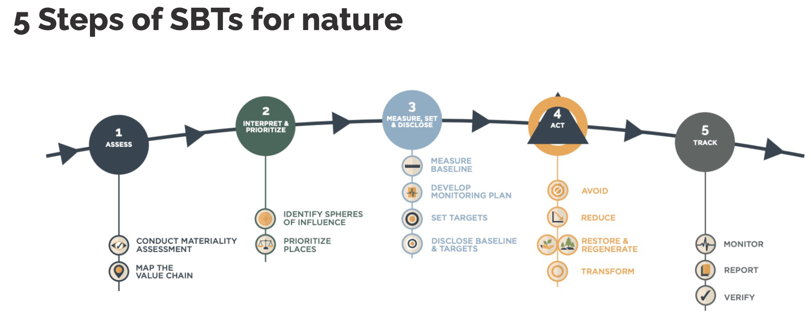

# Roadmap

The Nature Data Catalog roadmap can be broken down into the following four general phases as follows.

1.  Open Data Catalog

    Listing and searching of datasets via manual contributions. Listing hundreds of nature data sets, mapped to the TNFD framework with text based and index search organized by under 100 dimensions.
2.  Community Contributions

    Add support for community contributions, including vetting, curations, and review of new nature data sets by a scientific committee. Community ranking and reviews.
3.  Marketplace & Exchange

    Ability to ingest nature data sets and/or samples, create connectors to auto ingest and auto update data via API, support various data licensing models (public, private, paid, free etc.) and Indigenous data sovereignty (IDS) via licensing and usage measurements.
4.  Code & Models

    Ability to list and share code and models which are built upon datasets. Code contribution, data lineage users can upload nature data models and code with full forking, branching, version tracking etc. (Github capabilities)

<figure><figcaption>
The four phase of the nature data catalog project.
</figcaption></figure>
